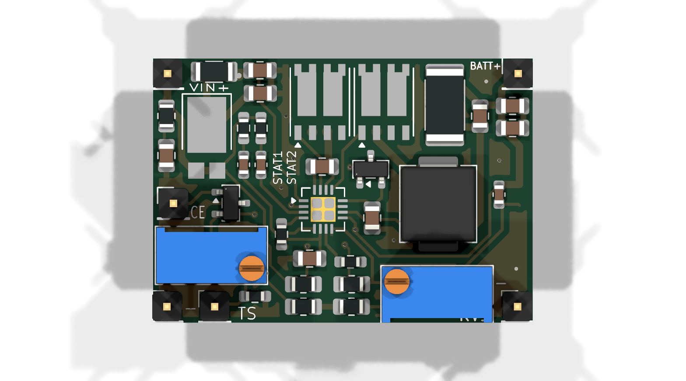
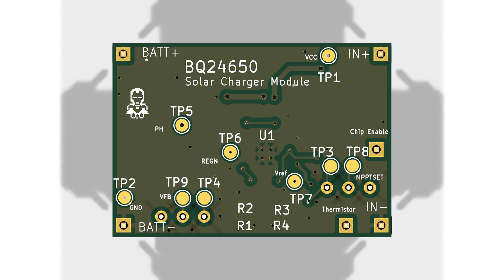

# BQ24650 1U SolarChargerBoard 

A dev/eval board for the **TI BQ24650** standalone solar battery charger IC. The board was developed to provide a simpler and more custom platform for evaluating the BQ24650 for ANANTSAT-I(1u mission) after the standard eval-board proved unsuitable for the intended testing. It implements the complete synchronous buck battery charger power stage required by the charger IC, while exposing adjustable potentiometers for configuring the battery regulation voltage and the constant-voltage MPPT operating point, also has LEDs for the BQ2460 status pins. Temp sense pin is available for using external thermocoupler/thermistor.

### Board at a glance

| Item              | Description                                          |
| ----------------- | ---------------------------------------------------- |
| Charger IC        | Texas Instruments BQ24650                            |
| MPPT              | Adjustable constant-voltage MPPT using potentiometer |
| Input Source      | Solar panel                                          |
| Charge Voltage    | Adjustable using potentiometer                       |
| Power Stage       | External NMOS MOSFETs and inductor                   |
| Monitoring        | Multiple test points for evaluation                  |
| Temperature Input | TS connector for battery temperature sensing         |

## Schematic

## PCB

  
  

## Key Components

| Reference  | Part           | Function                              |
| ---------- | -------------- | ------------------------------------- |
| U1         | BQ24650        | Solar battery charger controller      |
| Q1, Q2, Q3 | NMOS MOSFET    | Synchronous buck power stage, act as switch for shut down          |
| L1         | Inductor       | Buck converter        |
| D2         | Schottky Diode | Power path/freewheeling diode         |
| RV1        | Potentiometer  | Battery regulation voltage adjustment |
| RV2        | Potentiometer  | MPPT voltage adjustment               |
| D1         | Power diode    | Input protection / power path         |

## Connectors & I/O

| Reference | Interface   | Description                           |
| --------- | ----------- | ------------------------------------- |
| J1        | CE/MPPSET   | Charger enable and MPPT configuration |
| J2        | Solar+      | Solar panel input                     |
| J3        | Solar−      | Solar panel return                    |
| J4        | BATT+       | Battery positive connection           |
| J5        | BATT−       | Battery return                        |
| J6        | TS          | Battery temperature sensing input     |
| TP1–TP9   | Test Points | Circuit measurement and debugging     |

Designed and developed as part of **Team Anant**.

